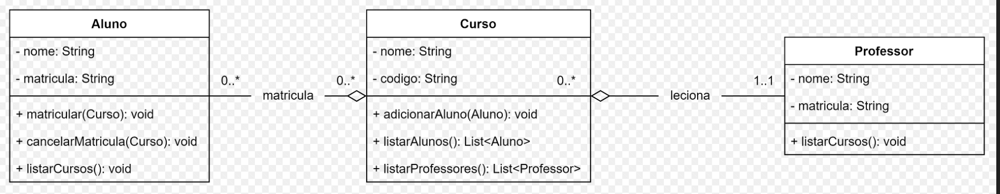

# Sistema de Gestão de Cursos

Este é um sistema simples de gestão de cursos, alunos e professores, implementado em Java. Ele representa um diagrama de classes básico, onde alunos podem se matricular em cursos, professores podem lecionar em cursos, e os relacionamentos entre as entidades são bidirecionais.

## **Diagrama de Classes**

O código foi desenvolvido com base no seguinte diagrama de classes:

 <!-- Coloque o arquivo do diagrama aqui, se possível -->

## **Funcionamento**

O sistema possui três entidades principais:

1. **Aluno**

   - Atributos: `nome`, `matricula`.
   - Métodos:
     - `matricular(Curso curso)`: Matricula o aluno em um curso.
     - `cancelarMatricula(Curso curso)`: Cancela a matrícula do aluno em um curso.
     - `listarCursos()`: Lista todos os cursos em que o aluno está matriculado.

2. **Curso**

   - Atributos: `nome`, `codigo`.
   - Métodos:
     - `adicionarAluno(Aluno aluno)`: Adiciona um aluno ao curso.
     - `removerAluno(Aluno aluno)`: Remove um aluno do curso.
     - `listarAlunos()`: Lista todos os alunos matriculados no curso.
     - `listarProfessores()`: Lista os professores associados ao curso.
     - `adicionarProfessor(Professor professor)`: Associa um professor ao curso.

3. **Professor**
   - Atributos: `nome`, `matricula`.
   - Métodos:
     - `listarCursos()`: Lista os cursos que o professor leciona.
     - `adicionarCurso(Curso curso)`: Adiciona um curso à lista de cursos que o professor leciona.

## **Arquivos do Projeto**

O código está organizado em quatro arquivos principais:

- `Aluno.java`: Classe que define o aluno.
- `Curso.java`: Classe que define o curso.
- `Professor.java`: Classe que define o professor.
- `Main.java`: Classe principal que contém o ponto de entrada do programa.

### Estrutura do Diretório

```
src/
├── Aluno.java
├── Curso.java
├── Professor.java
└── Main.java
```

## **Pré-requisitos**

- [Java Development Kit (JDK)](https://www.oracle.com/java/technologies/javase-downloads.html) instalado (versão 8 ou superior).
- Um terminal ou um IDE como [IntelliJ IDEA](https://www.jetbrains.com/idea/) ou [Eclipse](https://www.eclipse.org/ide/).

## **Como Configurar e Executar**

### 1. Clonar o Repositório

Clone o repositório para sua máquina local usando:

```bash
git clone https://github.com/natybastosp/facudade/tree/d97660397da21fe9516722076530dcf206fa3bd8/DiagramaDeClasses
```

### 2. Navegar para o Diretório

```bash
cd sistema-gestao-cursos/src
```

### 3. Compilar os Arquivos

Compile todos os arquivos `.java` juntos para resolver as dependências:

```bash
javac *.java
```

### 4. Executar o Programa

Execute o programa principal:

```bash
java Main
```

## **Funcionalidades**

O programa demonstra as seguintes funcionalidades:

1. Criação de alunos, cursos e professores.
2. Matrícula de alunos em cursos.
3. Associação de professores a cursos.
4. Listagem de alunos matriculados em cursos.
5. Listagem de cursos que um aluno está matriculado.
6. Listagem de cursos que um professor leciona.

## **Exemplo de Saída**

Após executar o programa, a saída esperada será semelhante a esta:

```
Cursos matriculados por João:
- Matemática
- Física

Cursos matriculados por Maria:
- Matemática

Alunos no curso de Matemática:
- João
- Maria

Cursos lecionados por Dr. Silva:
- Matemática
- Física
```

---
