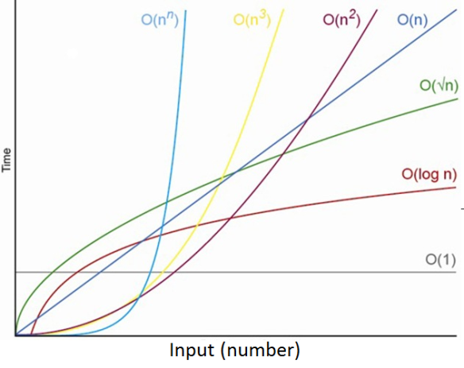

# Complexidade

```c
void singleLoop(int n) {
    for (int i = 0; i < n; i++) {
        printf("oi");
    }
}
```

O código acima tem complexidade O(n), pois temos um único loop que vai de 0 até n.

```c

void nestedLoops(int n) {
    for (int i = 0; i < n; i++) {
        for (int j = 0; j < n; j++) {
            printf("oi");
        }
    }
}

```

O código acima tem complexidade O(n^2), pois temos dois loops aninhados que vão de 0 até n.

---



- A linha verde representa a complexidade **O(log n)**, que cresce de forma logarítmica com o tamanho da entrada.
- A linha amarela representa a complexidade **O(n log n)**, que cresce linearmente multiplicada por um fator logarítmico.
- Para valores pequenos de **n**, as diferenças entre **O(log n)**, **O(n)**, **O(n log n)** e **O(n^2)** não são tão significativas.
- À medida que **n** aumenta, a diferença entre as complexidades se torna mais evidente, com **O(n^2)** crescendo mais rapidamente, seguido por **O(n log n)**, **O(n)** e **O(log n)**.
- A complexidade **O(log n)** cresce mais lentamente e é a mais eficiente entre as quatro para grandes valores de **n**.
- A complexidade **O(n log n)** é mais eficiente que **O(n^2)** mas menos eficiente que **O(n)** para grandes valores de **n**.

---

## Exemplos de Complexidade

**Exemplo 1:**

```c

int fib(int n){

    if(n<=1) return n;
    return fib(n-1) + fib(n-2);

}

```

```c
fib(4)
├── fib(3)
│   ├── fib(2)
│   │   ├── fib(1)
│   │   └── fib(0)
│   └── fib(1)
├── fib(2)
│   ├── fib(1)
│   └── fib(0)
```

- A função acima tem complexidade **O(2^n)**, pois a cada chamada recursiva, a função é chamada duas vezes.
- n=1, 1 chamada
- n=2, 3 chamadas
- n=3, 5 chamadas
- n=4, 9 chamadas
- n=5, 17 chamadas

**Exemplo 2:**

```c

int funcao(int n){

    int x = 0;
    while(n>0){
        x += n;
        n /= 2;
    }
}

```

- A função acima tem complexidade **O(log n)**, pois a cada iteração, **n** é dividido por 2.

```c
 n | #
 1 | 1
 2 | 2
 3 | 2
 4 | 3
 5 | 3
```

**Exemplo 3:**

```c

    int funcao(int n){
        for(int i=0; i<n; i++){
            for(int j=0; j<i; j++){
                printf("oi");
            }
        }
    }

```

- A função acima tem complexidade **O(n^2)**, pois temos dois loops aninhados que vão de 0 até n.

```c
 n | #
 1 | 0
 2 | 1
 3 | 3
 4 | 6
 5 | 10

```

**Exemplo 5:**

```c

    int funcao(int n){
        int soma = 0;
        for(int i=0; i<n; i++){
            for(int j=0; j<n; j++){
                soma += i+j;
            }
        }
    }

```

- A função acima tem complexidade **O(n^2)**, pois temos dois loops aninhados que vão de 0 até n.

```c
 n | #
 1 | 1
 2 | 4
 3 | 9
 4 | 16
 5 | 25
```
