# Implementação e Análise de Sistemas Distribuídos: Experiência Prática com HDFS e PySpark

## Equipe

Este trabalho foi desenvolvido na disciplina de Sistemas Distribuídos por:

| Autor                     | Matrícula  | Função                   |
| ------------------------- | ---------- | ------------------------ |
| Artur da Silva Oliveira   | 2122082008 | Configuração de rede     |
| Eduardo Costa Virmond     | 1922082002 | Implementação HDFS       |
| João Víctor Alves Menezes | 2122082017 | Configuração PySpark     |
| Juliana Alves Pacheco     | 2122082026 | Documentação             |
| Natália Bastos Pereira    | 2212082020 | Testes e validação       |
| Rafael Dantas Boeira      | 2122082004 | Coordenação e integração |

## Resumo

Este documento apresenta uma análise detalhada da implementação e configuração de um sistema distribuído baseado no ecossistema Hadoop, com foco no Sistema de Arquivos Distribuído Hadoop (HDFS) e PySpark. A pesquisa documenta os procedimentos realizados em três laboratórios práticos, abordando desde a instalação e configuração do ambiente base até a execução de tarefas de processamento distribuído. O estudo demonstra a aplicabilidade prática desses sistemas e discute os conhecimentos adquiridos durante o processo de implementação.

## 1. Introdução

Os sistemas distribuídos têm se tornado fundamentais para o processamento de grandes volumes de dados. O ecossistema Hadoop, especialmente com seu sistema de arquivos distribuído (HDFS) e ferramentas como PySpark, representa uma solução robusta para esse cenário. Este documento registra a experiência prática de implementação desses sistemas em um ambiente controlado, demonstrando os procedimentos necessários para sua instalação, configuração e operação.

## 2. Materiais e Métodos

O estudo foi conduzido realizando experimentos em três etapas laboratoriais sequenciais:

### 2.1 Laboratório 1: Configuração do Ambiente Base

O primeiro laboratório concentrou-se na instalação e configuração do sistema operacional Ubuntu Server, que serviu como base para o sistema distribuído. Os procedimentos incluíram:

```bash
# Instale o sistema operacional Ubuntu Server
# Faça o update e upgrade
sudo apt update
sudo apt upgrade

# Verifique se a data e hora estão atualizadas
date

# Instale os aplicativos para sincronização de tempo
sudo apt install ntp ntpsec-ntpdate
sudo ntpq -p

# Altere o timezone
sudo dpkg-reconfigure tzdata

# Verifique a data e a hora novamente
date
```

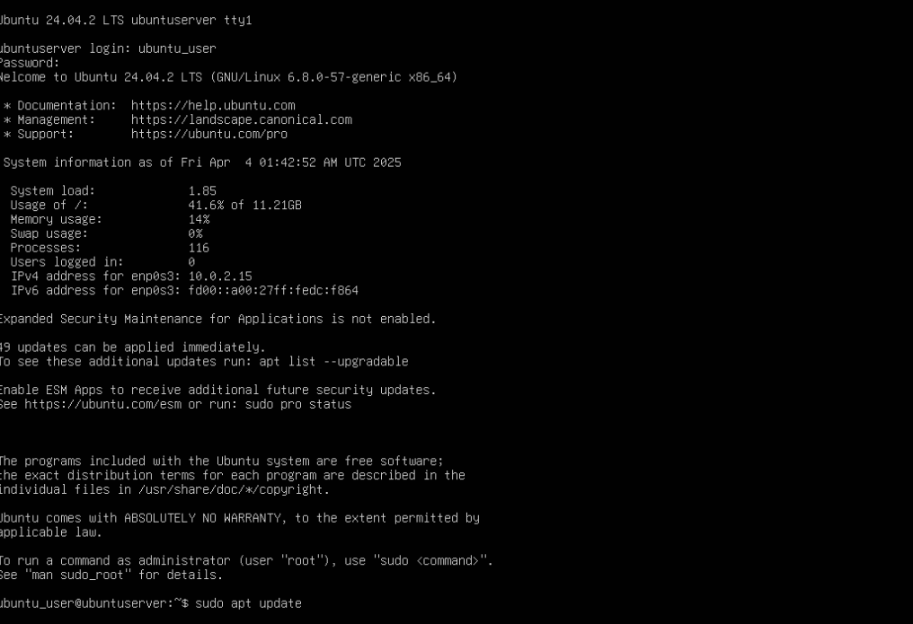
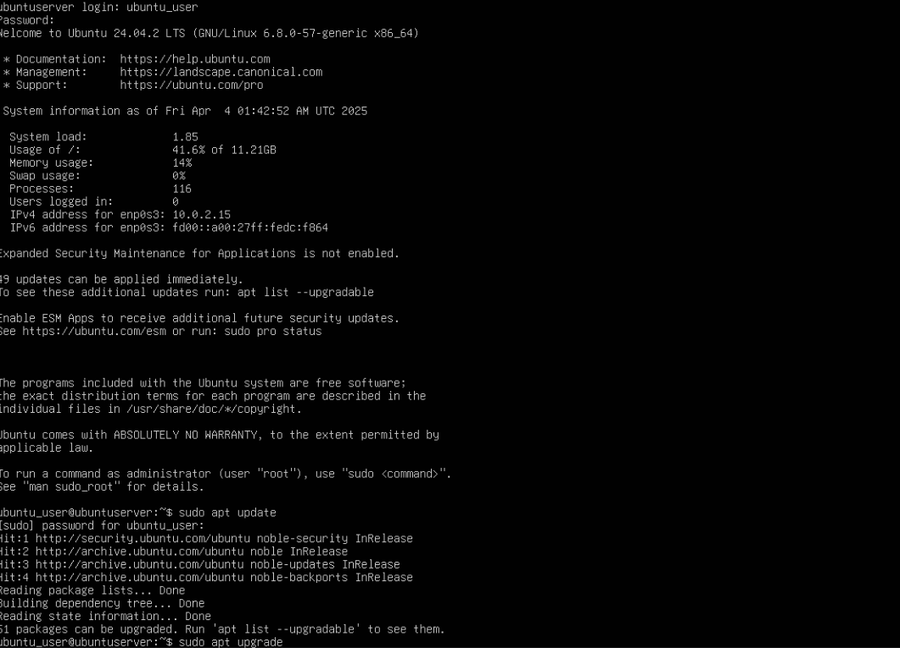
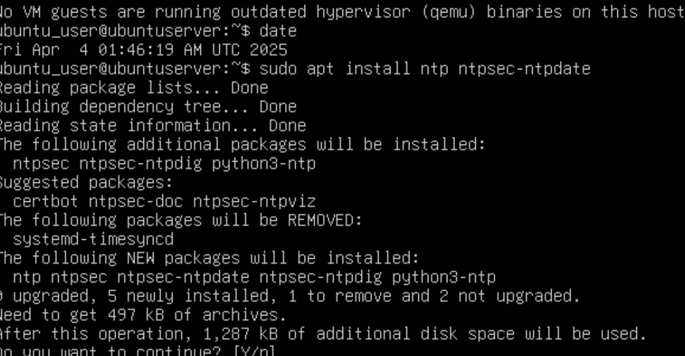
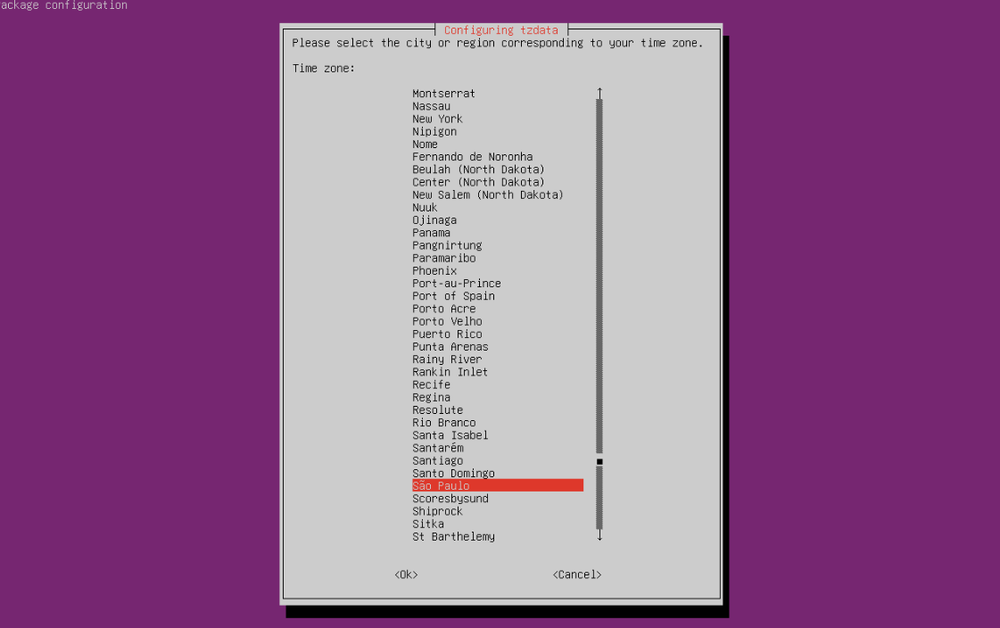
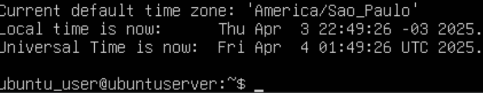

### 2.2 Laboratório 2: Implementação do HDFS

O segundo laboratório abordou a instalação e configuração do Hadoop Distributed File System, com os seguintes procedimentos:

```bash
sudo apt-get update
sudo apt-get upgrade
sudo apt-get install pdsh
echo "export PDSH_RCMD_TYPE=ssh" >> .bashrc
ssh-keygen -t rsa -P ""
cat ~/.ssh/id_rsa.pub >> ~/.ssh/authorized_keys
ssh localhost
sudo apt-get install openjdk-8-jdk

# Baixe do classroom ou da rede local o arquivo hadoop-3.4.0.tar.gz para a pasta home
# Alternativamente
# wget https://archive.apache.org/dist/hadoop/common/hadoop-3.4.0/hadoop-3.4.0.tar.gz

tar xvf hadoop-3.4.0.tar.gz
mv hadoop-3.4.0 hadoop
sudo mv hadoop /usr/local/hadoop
sudo nano /usr/local/hadoop/etc/hadoop/hadoop-env.sh
# Adicionar linha a seguir:
# export JAVA_HOME=/usr/lib/jvm/java-8-openjdk-amd64/

sudo nano /etc/environment
# Adicionar as linhas a seguir:
# PATH="/usr/local/sbin:/usr/local/bin:/usr/sbin:/usr/bin:/sbin:/bin:/usr/games:/usr/local/games:/usr/local/hadoop/bin:/usr/local/hadoop/sbin"
# JAVA_HOME="/usr/lib/jvm/java-8-openjdk-amd64/jre"

sudo poweroff
```

Instalação do Java e Hadoop

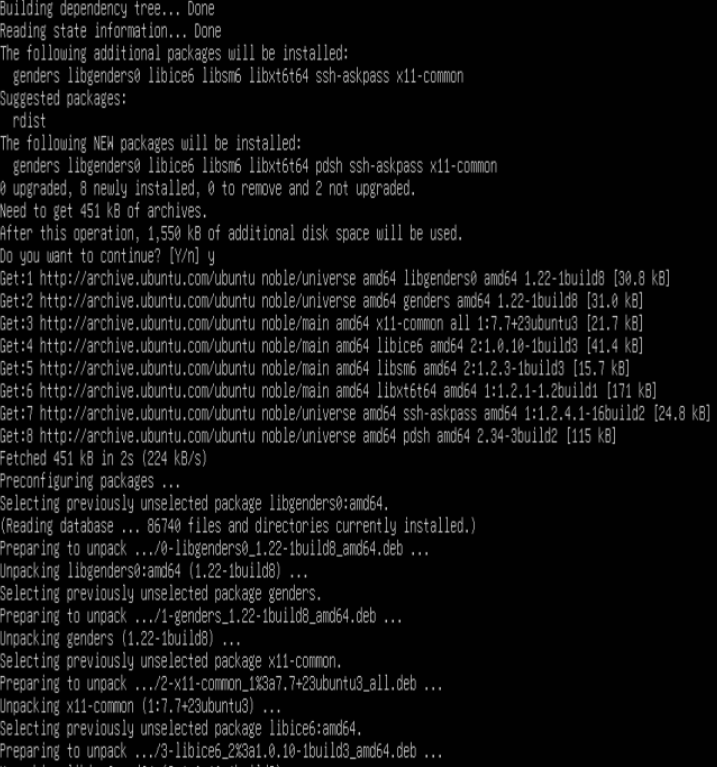
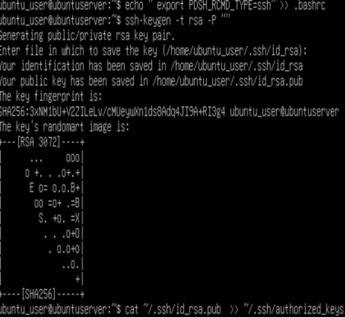

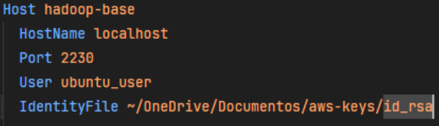

Instalação do Java e Hadoop

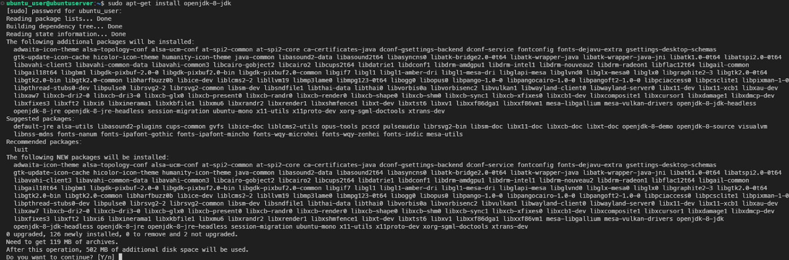
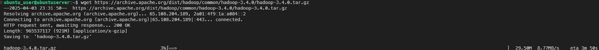

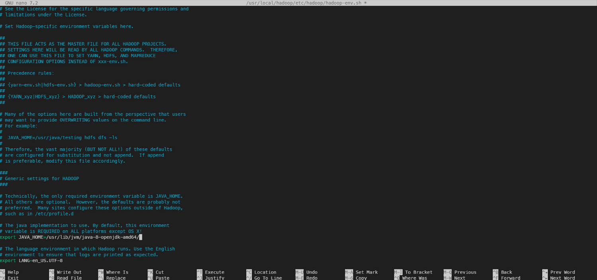
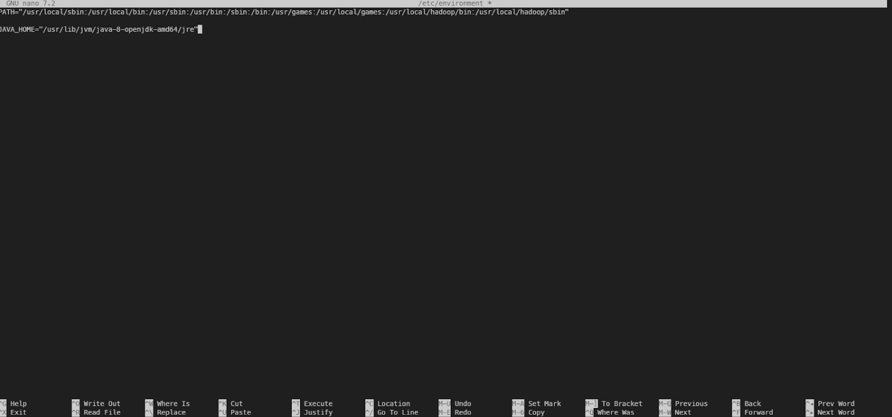
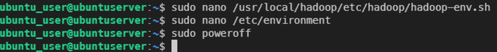

Após criar uma placa de rede HostOnly na máquina virtual, crie três clones da máquina base: 1 master e 2 workers.

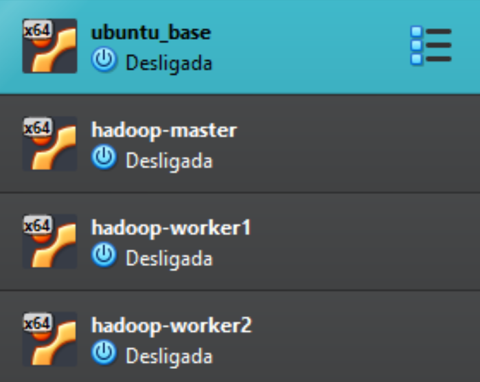


```bash
# Editar o arquivo hostname em cada máquina: hadoop-master, hadoop-worker1, hadoop-worker2
sudo nano /etc/hostname

# Faça o reboot dos servidores!
# Verifique o nome da placa, que no caso pode ser enp0s8
ip addr

# Editar os arquivos de rede das máquinas
# Colocar os IPs 172.31.110.10, 172.31.110.11 e 172.31.110.12 nas máquinas master e workers 1 e 2, respectivamente
cd /etc/netplan
sudo nano XXXXX.yaml

# Exemplo
# This is the network config written by 'subiquity'
network:
  version: 2
  ethernets:
    enp0s3:
      dhcp4: true
    enp0s8:
      dhcp4: false
      addresses: [172.31.110.10/24]

sudo netplan apply

# Editar o arquivo /etc/hosts incluindo os nomes e IPs
# hadoop-master, hadoop-worker1 e hadoop-worker2
# Não colocar 127.0.1.1 com o hostname
sudo nano /etc/hosts
# Adicionar:
172.31.110.10 hadoop-master
172.31.110.11 hadoop-worker1
172.31.110.12 hadoop-worker2
```

Configuração de rede e arquivo hosts


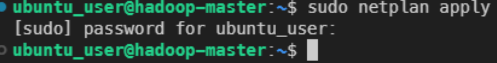
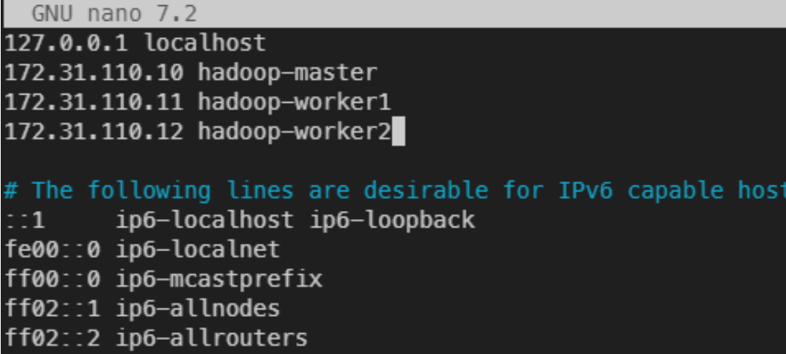
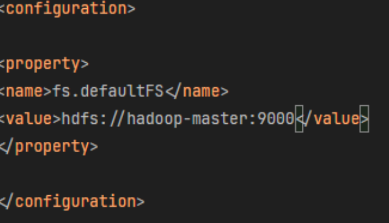
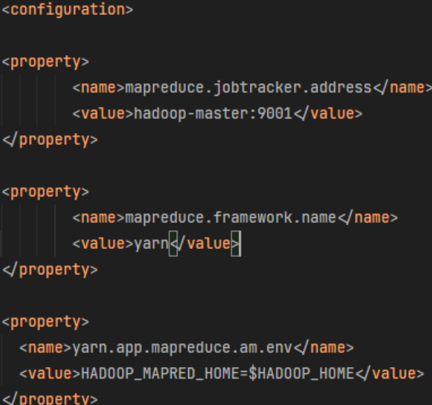
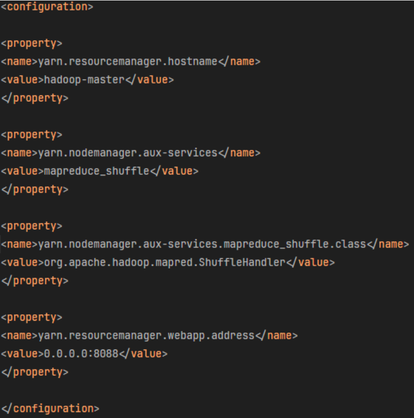
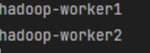

```bash
# Copiar os arquivos hadoop_files que estão no Classroom ou na rede local para /usr/local/hadoop/etc/hadoop no master
sudo apt-get install unzip
unzip hadoop_files
cp ~/hadoop_files/*.* /usr/local/hadoop/etc/hadoop

# Verifique o nome do hadoop-master e workers nos arquivos
# core-site.xml hdfs-site.xml mapred-site.xml workers yarn-site.xml
# Deve-se ajustar os arquivos para seu cluster (principalmente os nomes hosts)

# O mesmo arquivo deve ir para os workers, lembrando que tem que certificar os nomes hosts:
scp /usr/local/hadoop/etc/hadoop/* hadoop-worker1:/usr/local/hadoop/etc/hadoop/
scp /usr/local/hadoop/etc/hadoop/* hadoop-worker2:/usr/local/hadoop/etc/hadoop/
```

Transferência de arquivos de configuração

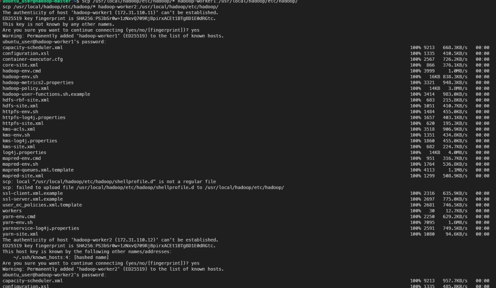
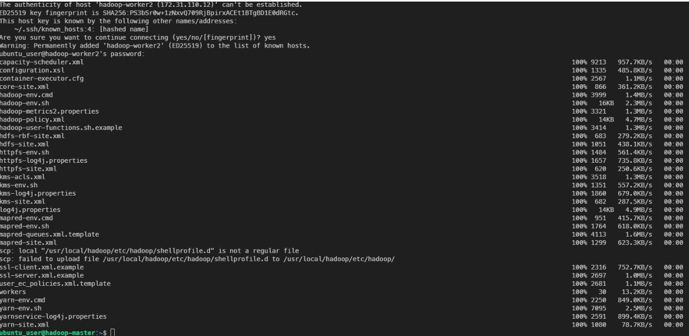
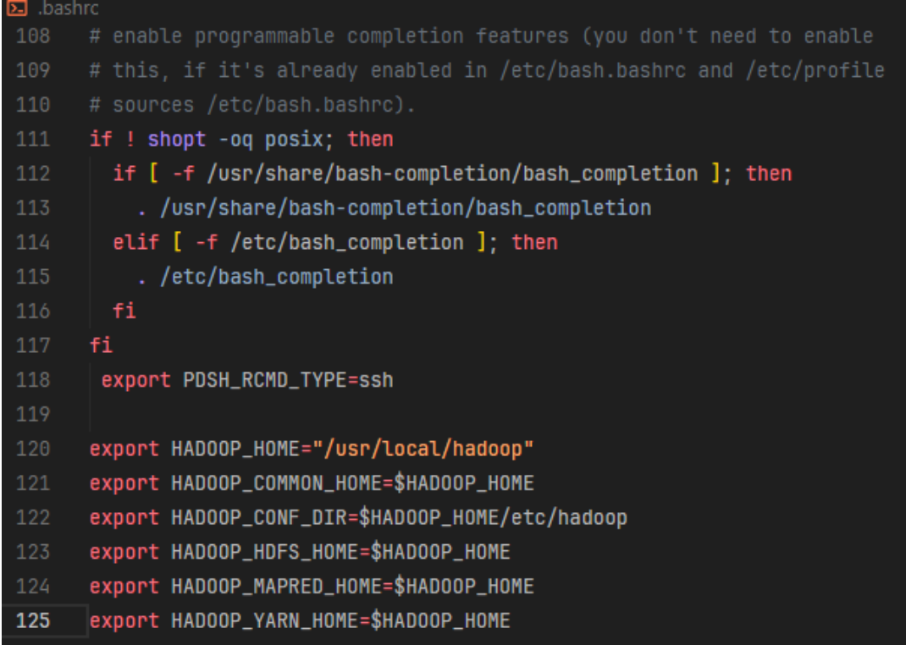
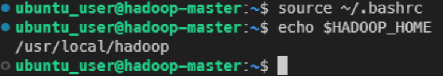
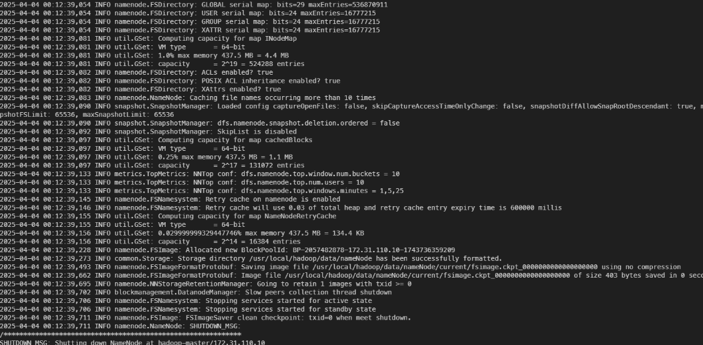

```bash
# Criando um ambiente virtual para o Hadoop
sudo nano ~/.bashrc
# Acrescente as seguintes variáveis em .bashrc do master
export HADOOP_HOME="/usr/local/hadoop"
export HADOOP_COMMON_HOME=$HADOOP_HOME
export HADOOP_CONF_DIR=$HADOOP_HOME/etc/hadoop
export HADOOP_HDFS_HOME=$HADOOP_HOME
export HADOOP_MAPRED_HOME=$HADOOP_HOME
export HADOOP_YARN_HOME=$HADOOP_HOME

# Recarregar as variáveis de ambiente
source ~/.bashrc

# Executar o comando para a formação do HDFS:
hdfs namenode -format

# Iniciar o HDFS
start-dfs.sh

# O comando jps serve para verificar os Datanodes e Namenodes ativos
jps
```

Saída do comando jps com nós ativos

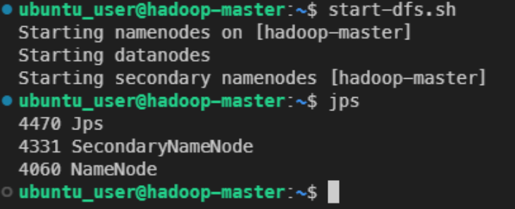
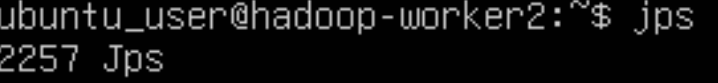


```bash
# Crie outro redirecionamento de porta para o Master na porta 9870 para 9870
# Acesse: http://localhost:9870/
# Clique em Utilities >> Browse the file system
```

Interface web do HDFS em localhost:9870

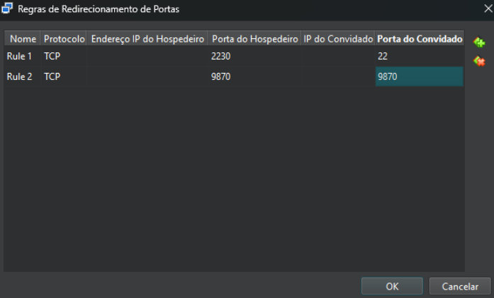

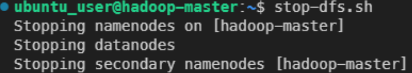

### 2.3 Laboratório 3: Operações HDFS e PySpark

O terceiro laboratório focou na utilização prática do HDFS e implementação do PySpark para processamento de dados:

```bash
# Procedimentos para a limpeza e formação do HDFS, caso necessário
# Deletar todos os arquivos das pastas dataNode e nameNode (é necessário que essas pastas existam)
sudo rm -R /usr/local/hadoop/data/*

# Deletar os arquivos temporários
sudo rm -R /tmp/*

# Executar a formação do nameNode
hdfs namenode -format

# Iniciar o HDFS
start-dfs.sh

# Comandos exemplo para a operação do HDFS
hdfs dfs -mkdir /teste

# Clique em Utilities >> Browse the file system
vi ~/arquivo_de_teste.txt
hdfs dfs -put ~/arquivo_de_teste.txt /teste
hdfs dfs -ls /teste
mkdir ~/tmp
hdfs dfs -get /teste ~/tmp/
ls ~/tmp
hdfs dfs -rm /teste/arquivo_de_teste.txt
hdfs dfs -ls /teste
hdfs dfs -rm -r /teste
hdfs dfs -ls /
```

Operações de manipulação de arquivos no HDFS

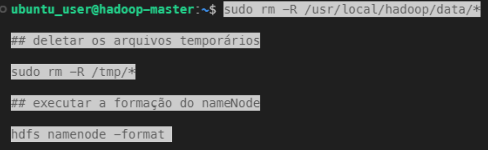
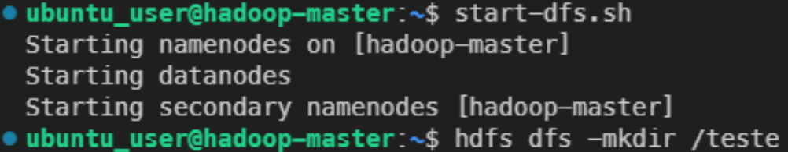


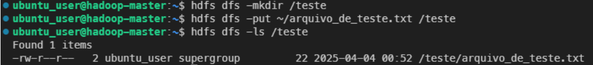
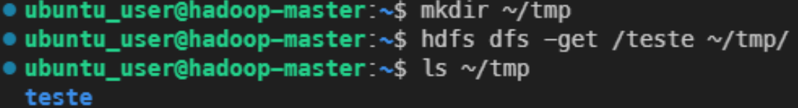
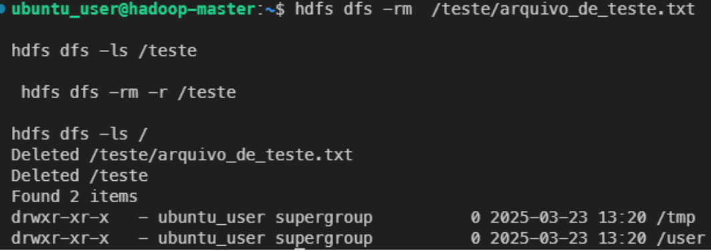

```bash
# Testando o YARN
start-yarn.sh  # ou /usr/local/hadoop/sbin/start-all.sh
yarn application -list
cat $HADOOP_HOME/logs/yarn-*-resourcemanager-*.log | tail -n 50

# Crie outro redirecionamento de porta para o Master no IP 172.31.110.10 na porta 8088
# Acesse: http://localhost:8088/
hadoop jar /usr/local/hadoop/share/hadoop/mapreduce/hadoop-mapreduce-examples-3.4.0.jar pi 30 100
```

Interface web do YARN em localhost:8088

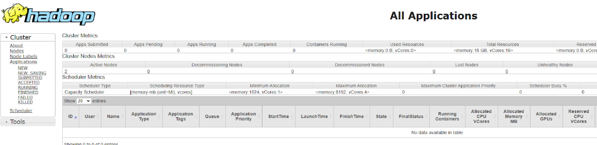

Cálculo de π

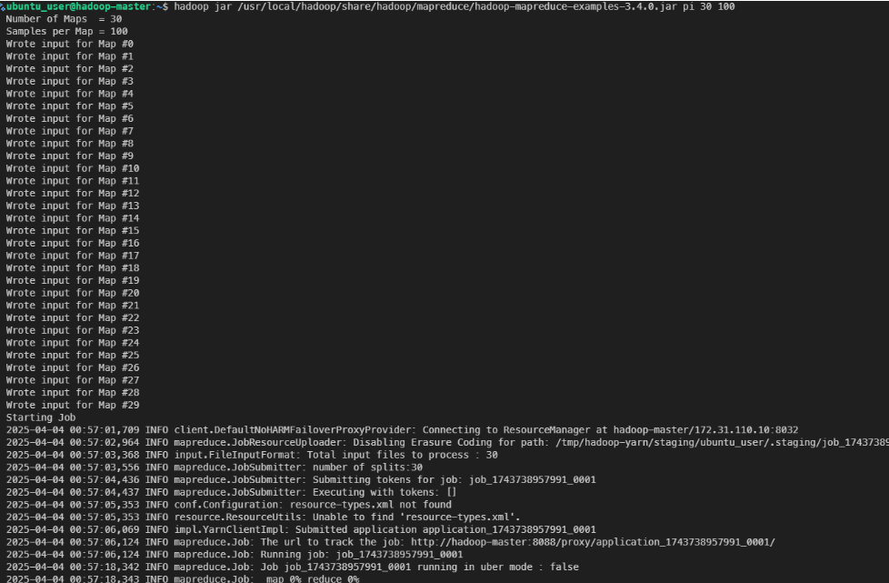
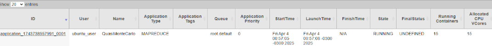
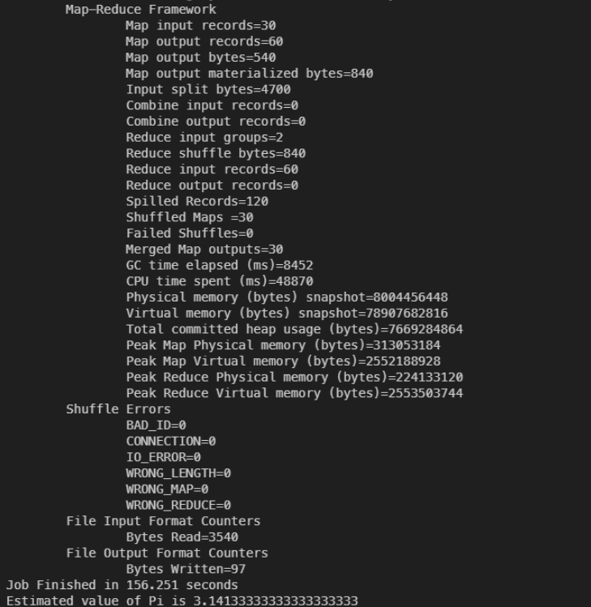

```bash
mkdir ~/gutenberg
wget https://www.gutenberg.org/cache/epub/20417/pg20417.txt > ~/gutenberg/pg20417.txt
cd ~/gutenberg/
hdfs dfs -mkdir -p /teste
hdfs dfs -put ~/gutenberg/pg20417.txt /teste
hadoop jar /usr/local/hadoop/share/hadoop/mapreduce/hadoop-mapreduce-examples-3.4.0.jar wordcount /teste/pg20417.txt /user/ubuntu_user/gutenberg-output/
hdfs dfs -cat /user/ubuntu_user/gutenberg-output/part-r-00000
```

Resultado da operação wordcount

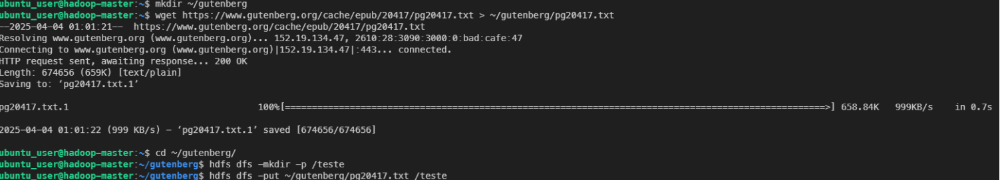
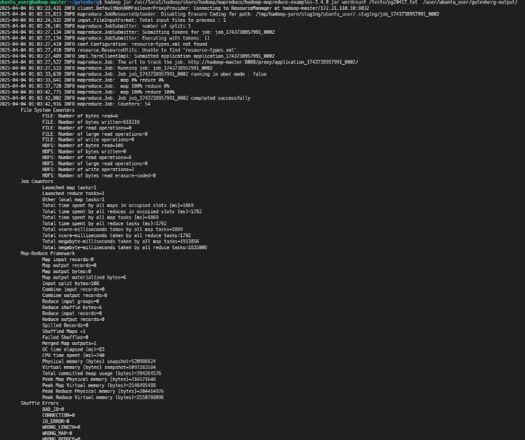


```bash
# Configuração e uso do PySpark
# Baixar spark do ClassRoom e colocar no diretório home
tar -xvzf spark-3.5.0-bin-hadoop3.tgz
mv spark-3.5.0-bin-hadoop3 spark
sudo mv spark /usr/local/spark
sudo nano ~/.bashrc
# Incluir essas linhas:
export SPARK_HOME="/usr/local/spark/"
export PATH="$PATH:$SPARK_HOME/bin"

# Carregar variáveis de ambiente
source ~/.bashrc
pyspark
```

Ambiente PySpark iniciado

```bash
# Criar um contexto de sessão do spark (cria um "programa")
sc = SparkContext.getOrCreate()

# Variável recebe o caminho que aponta para um arquivo de texto
file_path = "/teste/pg20417.txt"

# Leitura do arquivo de texto pelo programa spark
words = sc.textFile(f"{file_path}").flatMap(lambda line: line.split(" "))

# Contagem de palavras utilizando a sintaxe facilitada do pyspark
wordCounts = words.map(lambda word: (word, 1)).reduceByKey(lambda a,b:a +b)

# Salvando arquivo com resultado da execução
wordCounts.saveAsTextFile(f"{'/'.join(file_path.split('/')[:-1])}/word_count")
wordCounts.count()
```


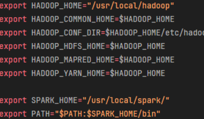
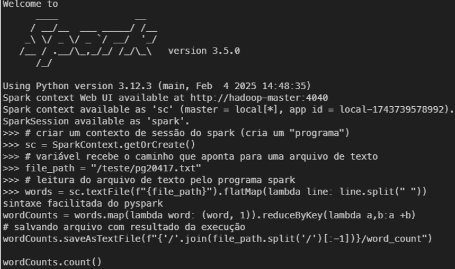
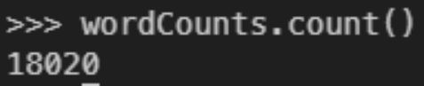'

## 3. Resultados e Discussão

A implementação do ambiente distribuído permitiu responder diversas questões técnicas e aprofundar o conhecimento em várias áreas:

### 3.1 Configuração de Sistemas

Foi possível compreender os procedimentos para a instalação e configuração adequada do Ubuntu Server, incluindo a sincronização de tempo e ajuste do fuso horário, elementos críticos para o funcionamento coordenado de sistemas distribuídos.

### 3.2 Implementação do Hadoop

O laboratório proporcionou conhecimento prático sobre a instalação e configuração do ecossistema Hadoop, incluindo:

- Instalação de dependências como Java e ferramentas auxiliares
- Configuração de variáveis de ambiente
- Ajuste de arquivos de configuração específicos do Hadoop
- Estabelecimento de comunicação segura entre os nós através de SSH

### 3.3 Configuração de Rede e Cluster

Os experimentos demonstraram a importância da configuração adequada da rede para sistemas distribuídos:

- Definição de IPs estáticos para cada nó
- Configuração de nomes de host e DNS local via arquivo `/etc/hosts`
- Estratégias para comunicação eficiente entre nós

### 3.4 Operações no HDFS

Foram executadas e compreendidas operações fundamentais no sistema de arquivos distribuído:

- Criação de diretórios e manipulação de arquivos
- Transferência de dados entre o sistema de arquivos local e o HDFS
- Monitoramento e verificação do estado do sistema

### 3.5 MapReduce e Processamento Distribuído

Os laboratórios permitiram a implementação de exemplos de processamento distribuído:

- Execução de jobs MapReduce para cálculo de π
- Implementação de contagem de palavras (wordcount) em documentos
- Monitoramento de aplicações através do YARN

### 3.6 PySpark e Análise de Dados

A utilização do PySpark demonstrou o potencial para análise de dados em grande escala:

- Configuração e uso da API Python para o Spark
- Implementação de algoritmos para contagem de palavras em documentos
- Armazenamento e recuperação de resultados processados

### 3.7 Gestão do Cluster

Os procedimentos de inicialização e encerramento adequados do cluster foram compreendidos:

- Inicialização e parada coordenada dos serviços
- Utilização de ferramentas como `sshpass` para automação de tarefas
- Monitoramento do estado do cluster

## 4. Curiosidades e Dúvidas Respondidas

Durante os laboratórios, várias curiosidades e dúvidas foram respondidas, incluindo:

### 4.1 Configuração do Ubuntu Server

Durante a preparação do ambiente, aprendemos a importância crítica da sincronização de tempo em sistemas distribuídos. Sem uma sincronização precisa, os nós do cluster podem enfrentar problemas de coordenação, resultando em falhas de processamento ou inconsistência de dados.

### 4.2 Arquitetura do HDFS

Compreendemos como o HDFS divide e replica dados através de múltiplos nós, oferecendo tanto redundância quanto paralelismo. A divisão entre NameNode (para metadados) e DataNodes (para armazenamento) demonstra uma separação clara de responsabilidades.

### 4.3 Configuração e Instalação do Hadoop

Aprendemos os passos necessários para instalar e configurar o Hadoop em um cluster distribuído, incluindo a definição de variáveis de ambiente e o ajuste dos arquivos de configuração para refletir corretamente a topologia do cluster.

### 4.4 Operações Básicas no HDFS

Descobrimos como criar diretórios, transferir arquivos e listar dados no HDFS usando comandos como `hdfs dfs -put` e `hdfs dfs -get`, permitindo o gerenciamento eficiente dos dados no sistema distribuído.

### 4.5 Execução de Jobs MapReduce

Experimentamos a execução de exemplos de MapReduce, como o cálculo de π e contagem de palavras, e aprendemos a monitorar aplicações usando o YARN, obtendo insights sobre como trabalhos complexos são divididos e executados em paralelo.

### 4.6 Configuração e Uso do PySpark

Exploramos como instalar e configurar o PySpark em um ambiente Hadoop, e como executar scripts para processamento de dados, aproveitando a sintaxe intuitiva do Python para operações distribuídas complexas.

### 4.7 Gerenciamento de Cluster

Aprendemos técnicas para iniciar e parar os serviços do Hadoop de forma adequada, garantindo a integridade do sistema e dos dados durante o ciclo de vida do cluster.

### 4.8 Comunicação e Sincronização entre Nós

Compreendemos como configurar SSH para comunicação sem senha entre os nós do cluster e como usar ferramentas como `pdsh` para execução paralela de comandos, facilitando a administração do sistema.

### 4.9 Monitoramento e Depuração

Descobrimos como verificar processos em execução usando `jps` e como interpretar logs e saídas de jobs MapReduce, habilidades essenciais para manutenção e otimização do sistema.

## 5. Conclusões

Os laboratórios proporcionaram uma compreensão prática abrangente dos sistemas distribuídos baseados no ecossistema Hadoop. A experiência não apenas esclareceu dúvidas técnicas, mas também forneceu uma visão mais profunda de como esses sistemas funcionam na prática, desde a configuração inicial até a execução de tarefas complexas de processamento de dados.

A implementação passo a passo permitiu o desenvolvimento de habilidades técnicas essenciais para a administração e uso de sistemas distribuídos, demonstrando a viabilidade e o poder dessas tecnologias para processamento de grandes volumes de dados.

O conhecimento adquirido sobre HDFS, MapReduce e PySpark constitui uma base sólida para aplicações futuras em ambientes de Big Data, onde o processamento distribuído é fundamental para lidar com a escala crescente dos conjuntos de dados modernos.
